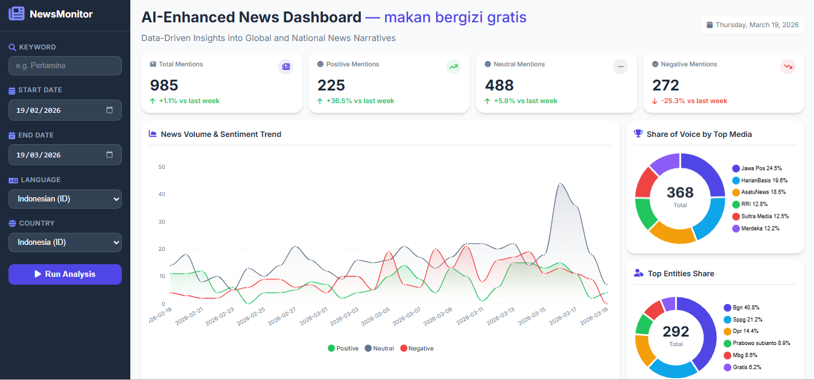
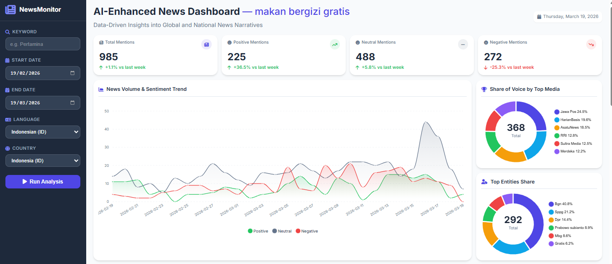
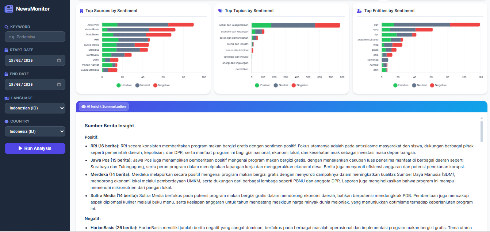
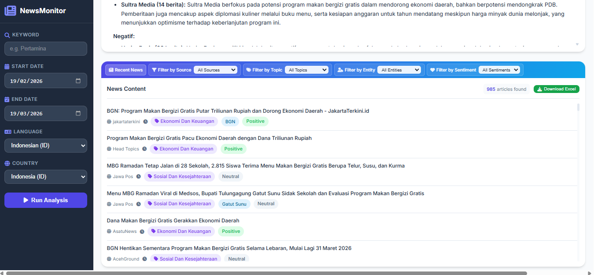
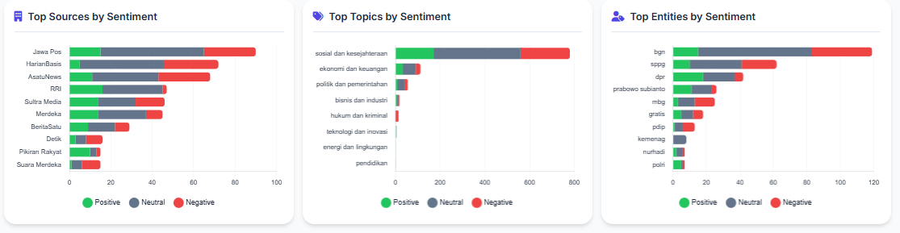
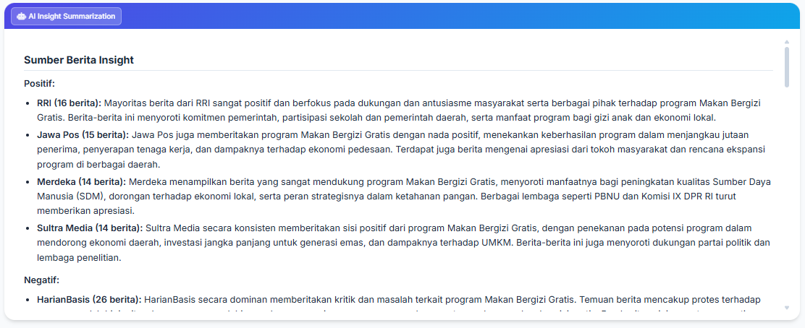
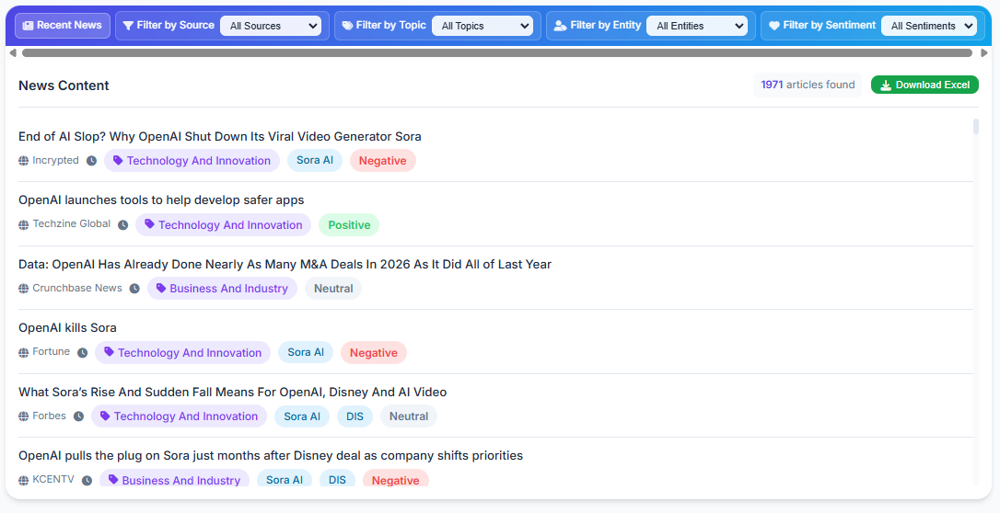

# News Article Monitoring

A web app that monitors news articles for any keyword. It scrapes **Google News RSS**, uses **Google Gemini AI** to classify sentiment, extract named entities, and assign topics — then displays everything in an interactive dashboard with charts and an AI-generated narrative summary.


# Table of Contents

- [For Developers](#for-developer)
  - [Project Structure](#project-structure)
  - [Run with Docker (Local)](#run-with-docker-local)
  - [Run Locally without Docker](#run-locally-without-docker)
  - [Deploy to Google Cloud Run](#deploy-to-google-cloud-run)
- [For Users](#for-user)
  - [Apps Features](#apps-features)
  - [How to Use the Apps](#how-to-use-the-apps)


# For Developer

## Project Structure

```
.
├── docker-compose.yml          # Runs frontend + backend containers locally
├── cloud-run-deploy.yaml       # Cloud Run multi-container deployment manifest
├── Makefile                    # Shortcuts for Docker operations
├── readme.md
├── .env                        # Your API keys — not committed to git
├── .gitignore
├── .dockerignore
│
├── backend/
│   ├── app.py                  # Flask app and API routes
│   ├── requirements.txt
│   ├── Dockerfile
│   ├── data/                   # Cached datasets (Excel / Parquet)
│   └── scripts/
│       ├── google_news_scraper.py   # Scrapes Google News RSS by date range
│       ├── data_processing.py       # AI pipeline: sentiment, NER, topic
│       └── ai_generate_insight.py   # AI narrative summary generation
│
├── frontend/
│   ├── Dockerfile
│   ├── nginx.conf              # Serves /static/, proxies everything else to Flask
│   ├── static/
│   │   ├── css/style.css
│   │   └── js/main.js
│   └── templates/
│       └── index.html
│
└── images/                     # Dashboard screenshots for readme
```


## Run with Docker (Local)

**Prerequisites:** [Docker Desktop](https://www.docker.com/products/docker-desktop/) and a [Google AI Studio](https://aistudio.google.com/) API key.

**1. Navigate to the project directory:**

```bash
cd path/to/prod_v1
```

**2. Create a `.env` file and add your Gemini API key:**

```
GEN_AI_API_KEY=your_google_ai_studio_api_key_here
```

**3. Make sure `nginx.conf` is set for local Docker use.**

In `frontend/nginx.conf`, the active `proxy_pass` line should be:

```nginx
proxy_pass http://backend:5000;   # for Docker Compose (local)
# proxy_pass http://localhost:5000;  # for Cloud Run
```

**4. Build and start:**

```bash
make up
```

**5. Open in browser:** `http://localhost`

### Makefile reference

| Command | Description |
|---|---|
| `make build` | Build (or rebuild) images |
| `make up` | Build and start all containers |
| `make start` | Start already-built containers |
| `make stop` | Stop containers |
| `make down` | Stop and remove containers |
| `make clean` | Full teardown (containers, images, volumes) |
| `make logs` | Tail live logs |


## Run Locally without Docker

**Prerequisites:** Python 3.11 and a [Google AI Studio](https://aistudio.google.com/) API key.

**1. Navigate to the project directory:**

```bash
cd path/to/prod_v1
```

**2. Create and activate a virtual environment:**

```bash
python -m venv venv

# Windows
venv\Scripts\activate

# macOS / Linux
source venv/bin/activate
```

**3. Install dependencies:**

```bash
pip install -r backend/requirements.txt
```

**4. Create a `.env` file and add your Gemini API key:**

```
GEN_AI_API_KEY=your_google_ai_studio_api_key_here
```

**5. Run:**

```bash
python backend/app.py
```

**6. Open in browser:** `http://localhost:5000`


## Deploy to Google Cloud Run

**Prerequisites:**
- [Docker Desktop](https://www.docker.com/products/docker-desktop/)
- [Google Cloud CLI](https://cloud.google.com/sdk/docs/install) authenticated
- Access to GCP project `zikrys-project`

---

### One-Time Setup

**1. Authenticate Docker with Artifact Registry:**

```bash
gcloud auth configure-docker asia-southeast2-docker.pkg.dev
```

**2. Allow public access (run once after first deploy):**

```powershell
gcloud run services add-iam-policy-binding news-monitoring-prod-v1 `
  --region asia-southeast2 `
  --member="allUsers" `
  --role="roles/run.invoker"
```

---

### Deploy / Redeploy Steps

**Step 1 — Set the API key as a Cloud Run environment variable**

In the Cloud Run console, go to your service → **Edit & Deploy New Revision** → **Variables & Secrets** tab, and add:

```
GEN_AI_API_KEY = your_google_ai_studio_api_key_here
```

Or via CLI:

```powershell
gcloud run services update news-monitoring-prod-v1 `
  --region asia-southeast2 `
  --update-env-vars GEN_AI_API_KEY="YOUR_ACTUAL_API_KEY"
```

> This only needs to be done once, or whenever you rotate the key.

**Step 2 — Switch `nginx.conf` to Cloud Run mode**

In `frontend/nginx.conf`, make sure it looks like this:

```nginx
proxy_pass http://localhost:5000;    # for Cloud Run
# proxy_pass http://backend:5000;   # for Docker Compose (local)
```

**Step 3 — Build images**

```powershell
docker build -f backend/Dockerfile  -t asia-southeast2-docker.pkg.dev/zikrys-project/news-monitoring-repo/news-monitoring-prod_v1-backend:latest  .
docker build -f frontend/Dockerfile -t asia-southeast2-docker.pkg.dev/zikrys-project/news-monitoring-repo/news-monitoring-prod_v1-frontend:latest .
```

**Step 4 — Push to Artifact Registry**

```powershell
docker push asia-southeast2-docker.pkg.dev/zikrys-project/news-monitoring-repo/news-monitoring-prod_v1-backend:latest
docker push asia-southeast2-docker.pkg.dev/zikrys-project/news-monitoring-repo/news-monitoring-prod_v1-frontend:latest
```

**Step 5 — Deploy**

```powershell
gcloud run services replace cloud-run-deploy.yaml --region asia-southeast2
```

**Step 6 — Get the live URL**

```powershell
gcloud run services describe news-monitoring-prod-v1 --region asia-southeast2 --format="value(status.url)"
```

---

### Cloud Run Reference

| Resource | Value |
|---|---|
| GCP Project | `zikrys-project` |
| Region | `asia-southeast2` |
| Artifact Registry | `asia-southeast2-docker.pkg.dev/zikrys-project/news-monitoring-repo/` |
| Cloud Run service | `news-monitoring-prod-v1` |

# For User

## Apps Features

The application consists of five main areas accessible from a single-page dashboard.

<p align="center"></p>

---

### 1. Keyword Selector & Run Analysis

A sidebar on the left provides controls for:

<p align="center"></p>

- **Keyword** — type or select the topic to monitor (e.g. "Pertamina")
- **Start Date / End Date** — date range for the news scrape
- **Language & Country** — locale settings passed to Google News RSS
- **Run Analysis** button — triggers a live scrape + AI enrichment pipeline and reloads all charts with fresh results

---

### 2. Summary KPI Cards

Four summary cards are displayed at the top of the main panel:

<p align="center"></p>

| Card | Description |
|---|---|
| **Total Mentions** | Total number of articles for the selected keyword, with week-over-week change |
| **Positive Mentions** | Count of positive articles with week-over-week % change |
| **Neutral Mentions** | Count of neutral articles with week-over-week % change |
| **Negative Mentions** | Count of negative articles with week-over-week % change |

---

### 3. Interactive Charts

The dashboard includes multiple chart types for deep analysis. The first section covers volume trends and share-of-voice:

<p align="center"></p>

| Chart | Description |
|---|---|
| **News Volume & Sentiment Trend** | Daily article count with positive / neutral / negative sentiment overlay as a multi-line chart |
| **Share of Voice by Top Media** | Donut chart showing each source's share of total article volume |
| **Top Entities Share** | Donut chart of the most-mentioned named entities across all articles |

The second section breaks down sentiment across sources, topics, and entities:

<p align="center"></p>

| Chart | Description |
|---|---|
| **Top Sources by Sentiment** | Horizontal stacked bar chart of the top 10 news sources, coloured by sentiment |
| **Top Topics by Sentiment** | Horizontal stacked bar showing sentiment distribution per news topic category |
| **Top Entities by Sentiment** | Horizontal stacked bar of the top 10 named entities, coloured by sentiment |

---

### 4. AI-Generated Insight


An **AI Insight Summarization** panel streams a narrative analysis generated by Gemini directly below the charts. The insight is structured into three sections:

<p align="center"></p>

- **Source analysis** — which sources drive positive vs. negative coverage and the key themes per source
- **Entity analysis** — which named entities appear most and in what sentiment context
- **Topic analysis** — which news topics dominate and their overall sentiment patterns

---

### 5. Recent News Content Table

A filterable article list at the bottom of the page shows every scraped article for the selected keyword. Users can filter by:

<p align="center"></p>

- **Source** — filter to a specific news outlet
- **Topic** — filter by AI-assigned topic category
- **Entity** — filter to articles mentioning a specific named entity
- **Sentiment** — show only positive, neutral, or negative articles

Each row shows the article headline (linked to the original source), publication source, timestamp, topic tag, entity tags, and sentiment label. A **Download Excel** button exports the full filtered dataset.


## How to Use the Dasboard

### Step 1 — Open the application

Navigate to `http://localhost` (Docker) or `http://localhost:5000` (local) in a web browser.

### Step 2 — Select a keyword

Use the **keyword dropdown** at the top of the page to choose the topic you want to monitor. The dashboard will immediately populate with pre-loaded data for that keyword.

### Step 3 — Run a fresh analysis

To scrape and analyse the latest news:

1. Set the **Start Date** and **End Date** for the period you want to monitor.
2. Click **Run Analysis**.
3. A progress indicator will appear while the scraper collects articles and the AI pipeline enriches them. This may take a few minutes depending on the date range and article volume.
4. The dashboard will automatically refresh when processing is complete.

### Step 4 — Explore the charts

Scroll through the dashboard to explore all chart sections. Most charts are interactive — hover over data points for exact values, click legend items to show/hide series, and zoom/pan where supported.

### Step 5 — Read the AI Insight

Scroll to the **AI Insight** section at the bottom. The narrative will stream in automatically, providing a written summary of source, entity, and topic patterns for the selected keyword.

### Step 6 — Read the news in detail and download

Scroll to the **Recent News** section at the bottom of the dashboard to browse the full list of scraped articles for the selected keyword.

**Filtering articles:**

Use the filter bar above the table to narrow down results:

| Filter | Description |
|---|---|
| **Filter by Source** | Show only articles from a specific news outlet |
| **Filter by Topic** | Show only articles under a specific AI-assigned topic |
| **Filter by Entity** | Show only articles that mention a specific named entity |
| **Filter by Sentiment** | Show only positive, neutral, or negative articles |

Filters can be combined — for example, show only *negative* articles from *HarianBasis* about *ekonomi dan keuangan*.

**Reading an article:**

Click any article headline in the table to open the original article in a new browser tab.

**Downloading the dataset:**

Click the **Download Excel** button (top-right of the table) to export all currently-displayed articles — respecting any active filters — as a `.xlsx` file. The file includes the headline, source, publication date, topic, entities, sentiment, and article URL for each row.